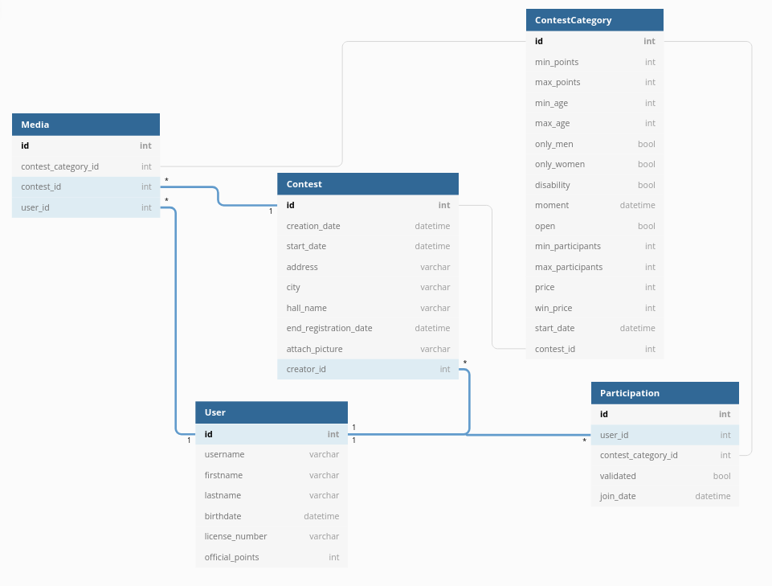

# Ping Contest

## About

Ping Contest is a mobile app developed to allow a better management of Table Tennis tournaments.

## Context
Being quite athletic, I participated in many tournaments in different sports. Over the years, I have seen many problems with the registration process and the management of sports tournaments. The first is the accessibility of the information because many tournaments are only announced on Facebook pages to which you must be a subscriber. (often the club page)
Then, the registration is only done by currency, it is currently impossible to pay by bank transfer.

So I had the idea of using my technical skills to allow both competitors and organizers to facilitate the management of tournaments. Not knowing all the sports and how their tournaments work, I decided to devote myself only to one sport, table tennis.

## Planned features

### Creation of a tournament

The application will allow tournament organizers to create a tournament by recording the series, the maximum number of players per series, the date of the event, its place, the registration price, the price of the contributions, etc. All these tournaments will be centralized on the application.

### Tournament management

The application will allow the organizers to update the tables when the results have been given as well as to add photos of the event. All information relating to the tournament may also be modified after its creation.

### Viewing a tournament

Competitors and other athletes will be able to see the tournament close to home easily.

### Registration for a tournament

Competitors wishing to participate in a tournament can register for it via the application but also make payment directly. They will no longer have to withdraw cash and bring it to the venue on the day of the competition.

## Technologies

### API : Using API Platform through the Symfony framework

A « framework » is a toolkit in the form of code files. It allows developers to focus on the main features of their project by providing an architecture, security rules, useful components, etc..

There are many frameworks, so why do I use Symfony?

Symfony is a french PHP framework, with a huge community. It benefits from regular updates and new annual versions that are always more efficient. It is therefore a very lively framework and it is easy to find help when a problem arises.

In addition, unlike many other frameworks, Symfony incorporates important security measures, making it possible to avoir most common flaws. It also integrates many modules of all kinds, allowing for example to create only an API (via API Platform), to notify users in real time when there is a change on the server (via Mercure), etc.. The possibilities are infinite and thought to facilitate development.

Finally, it is a technology that I use a lot for my personal projects but also in the professional environment.

API Platform is a module that can be easily installed via a Symfony API. It greatly simplifies development by providing for example, basic actions around entities. The developer does not need to develop the routes himself to fetch the articles, create one, delete one, etc.. It is nevertheless of course possible to create custom routes and modify the basic behavior of the classic routes. The creation of routes can be done only via annotations and makes development very fast.

### Using MySQL

MySQL is an open-source relational database management system created in 1995. Its use rather than another database manager like PostgreSQL is mainly explained by my habit of using it and its very simple and understandable interface.

### Using React Native

React Native is a framework for creating cross-platform mobile applications very simply using only the JavaScript langage. This framework is based on the React framework, itself designed to simplify the development of web platforms by providing reusable component development. React Native is a very reliable framework, developed by Facebook, with a huge community and many community plugins. Its choice over other mobile frameworks is primarily based on its cross-platform character. In addition, its simplicity of development, coupled with the use of Expo Go made me prefer React Native to Flutter for example.

### Using Expo Go

Expo Go is a tool and a mobile application allowing to test an application in React Native on all devices connected to the same network as the PC where the developer works. Thus, the developer can test in real time the modifications on the application on many devices at the same time, via the Internet.

### Using git

« git » is a tool for easily versioning code. It is the most used and popular version control tool. Thanks to its branching system, it makes it very easy to divide code versions. It provides a large number of commands allowing you to merge branches, view the differences between several branches, return to a previous state of the code, etc..

## Installation and deployment

The installation of the project will be done via a Docker container in order to avois dependency problems. A command will then retrieve the project, install the dependencies, create and update the database according to the Symfony entities and launch the API. The frontend will be launched in parallel and all you have to do is scan the QR code with Expo Go to test the application.

It will of course be possible to manually install the application and the API by following the steps described in the READme of the projects.

### Symfony Cloud

Thanks to Symfony Cloud, I will be able to ensure a continuous deployment of my Symfony application (and therefore of my API). By pushing updates to git, my cloud API will be automatically updated, allowing me to avoid manual releases with each new feature or bug fix.

## Database schema

## Sketch

